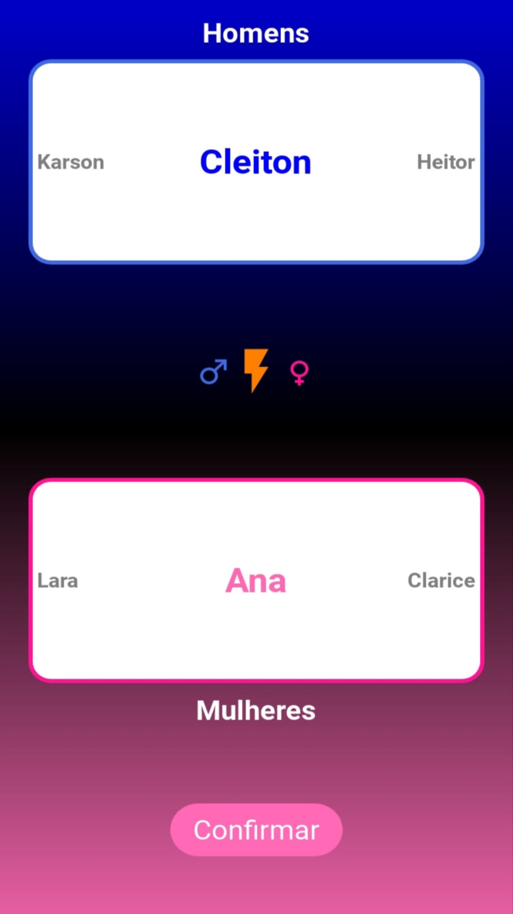
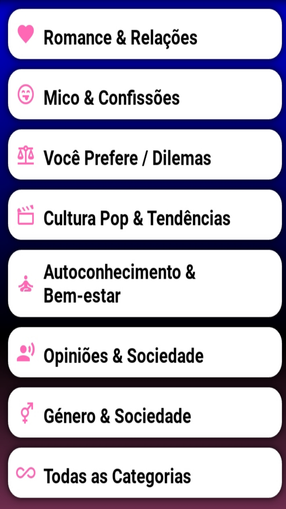
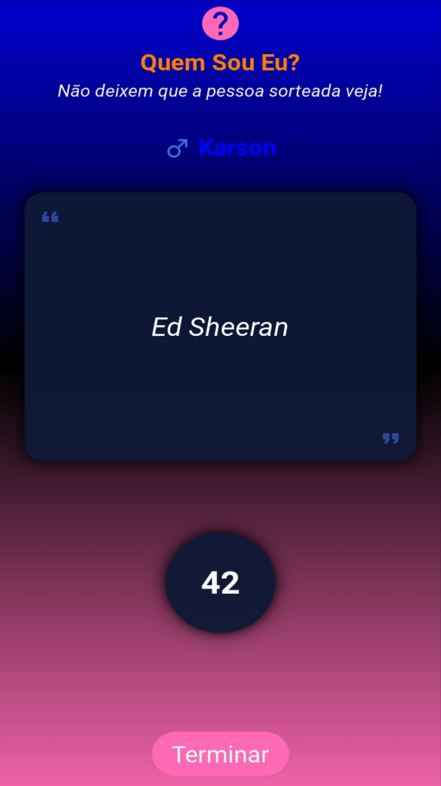
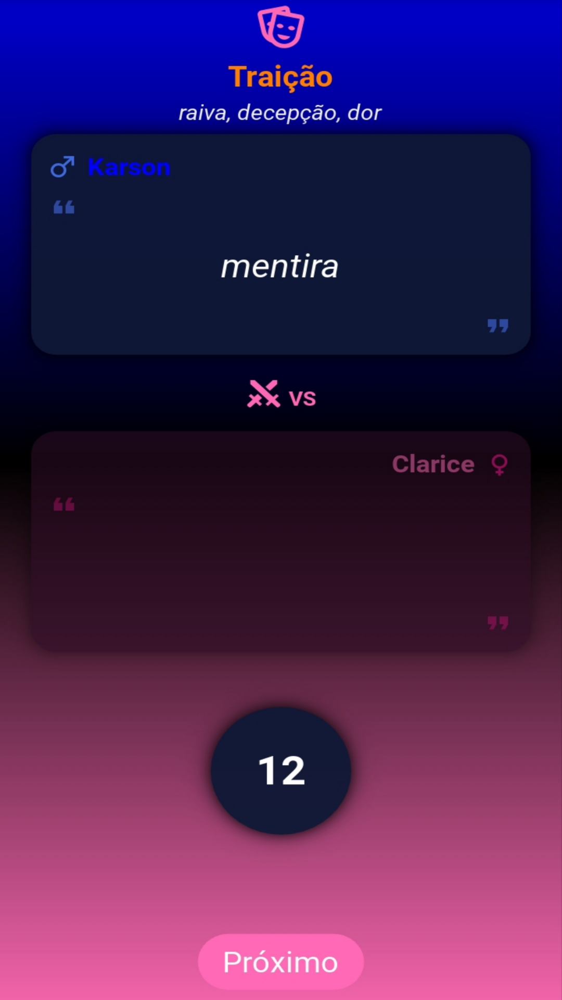
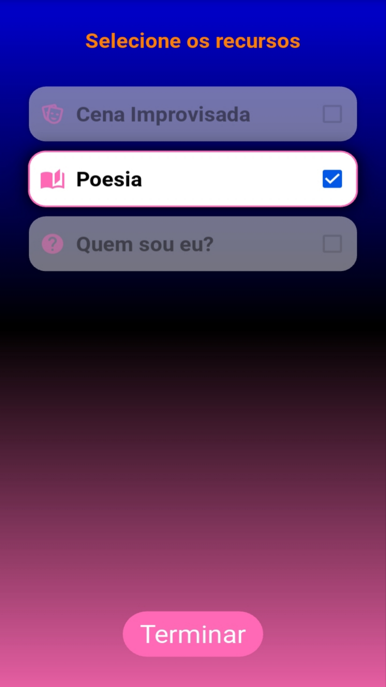

# Roda da Diversão

**An Android party game developed with Python and Kivy.**

Roda da Diversão is a mobile party game designed to bring friends and family together through quizzes, poetry, guessing games, and improvisation challenges.

The app offers four game modes, player registration, and customizable game content, making it suitable for parties, social gatherings, and group activities.

## Game Modes

### 1. Quiz

Players take turns asking questions. Each player answers a question from the player on their left or right, according to the game's flow, and then continues the round by asking the next question.

### 2. Poetry

The game selects one male and one female player to improvise and recite verses, taking turns one at a time.

### 3. Who Am I?

A player must identify a secret object, such as a celebrity, place, or animal, by asking questions that can be answered with **yes** or **no**. The player has 45 seconds to guess correctly.

### 4. Improvisation Scene

Two players receive a scene and words they must incorporate into their dialogue. They alternate speaking in 15-second turns, creating spontaneous and entertaining situations.

## Screenshots

### Player Registration

### Game Categories

### Quiz

### Poetry

### Who Am I?

### Improvisation Scene

### Game Resources

## Features

* Four interactive game modes.
* Player registration with name and gender.
* Duplicate player-name prevention.
* Timed guessing and improvisation challenges.
* Game content that can be expanded with additional questions, scenes, and objects.
* Interface designed for Android devices.

## Technologies

* **Python** — application logic.
* **Kivy** — cross-platform graphical user interface.
* **KivyMD** — Material Design components, where applicable.

## Requirements

* Android 5.0 or later.

## Get the App

Download Roda da Diversão from the Google Play Store:

[**Download Roda da Diversão**](https://play.google.com/store/apps/details?id=com.candidomanuel.rodadadiversao)

## Project Information

* **Developer:** Cândido Manuel
* **Platform:** Android
* **Version:** 0.1
* **Initial release:** August 2026

## About This Repository

This repository serves as a public showcase of Roda da Diversão, including its features and user interface screenshots. The application's source code is not included.
